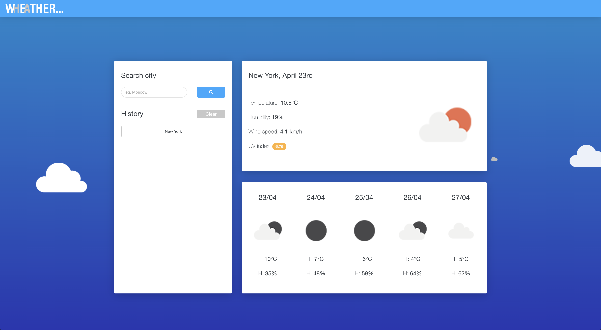

  [contributors-shield]: https://img.shields.io/github/contributors/yours-kkuznets/Good-README-Generator.svg?style=flat-square
  [contributors-url]: https://github.com/yours-kkuznets/Good-README-Generator/graphs/contributors
  [forks-shield]: https://img.shields.io/github/forks/yours-kkuznets/Good-README-Generator.svg?style=flat-square
  [forks-url]: https://github.com/yours-kkuznets/Good-README-Generator/network/members
  [stars-shield]: https://img.shields.io/github/stars/yours-kkuznets/Good-README-Generator.svg?style=flat-square
  [stars-url]: https://github.com/yours-kkuznets/Good-README-Generator/stargazers
  [issues-shield]: https://img.shields.io/github/issues/yours-kkuznets/Good-README-Generator.svg?style=flat-square
  [issues-url]: https://github.com/yours-kkuznets/Good-README-Generator/issues
  [license-shield]: https://img.shields.io/github/license/yours-kkuznets/Good-README-Generator.svg?style=flat-square
  [license-url]: https://github.com/yours-kkuznets/Good-README-Generator/blob/master/LICENSE.txt

  [![Contributors][contributors-shield]][contributors-url] [![Forks][forks-shield]][forks-url] [![Stargazers][stars-shield]][stars-url] [![Issues][issues-shield]][issues-url] [![License.txt][license-shield]][license-url]

  # Good-README-Generator

  ## Description

  ## Table of Contents
  - [Title](#title)
  - [Description](#description)
  - [Table of Contents](#table-of-contents)
  - [Screenshots](#screenshots)
  - [Installation](#installation)
  - [Usage](#usage)
  - [Testing](#testing)
  - [Additional Information](#additional-information)
  - [License](#license)
  - [Contributing](#contributing)
  - [Questions and Feedback](#questions-and-feedback)

  ## Screenshots
  

  ## Installation
  Download (and unpack) or clone the repo, then using a CLI run the `npm install` command.

  ## Usage
  Run the application with the CLI command `node index.js` and follow the prompts.

  ## Testing
  Run the tests with the CLI command `npm test`.

  ## Additional Information
  No info

  ## License
  This project is licensed under the MIT License - see the [LICENSE.txt](https://github.com/yours-kkuznets/Wheather-Forecast/blob/master/LICENSE.txt) file for details

  ## Contributing
  Please read [CONTRIBUTING.md](https://github.com/yours-kkuznets/Good-README-Generator/blob/master/CONTRIBUTING.md) for details on the code of conduct, and the process for submitting pull requests.

  ## Questions and Feedback
  Please contact me using one of the following:
  - Github:  
  - Email: yours.kkuznets@gmail.com
  